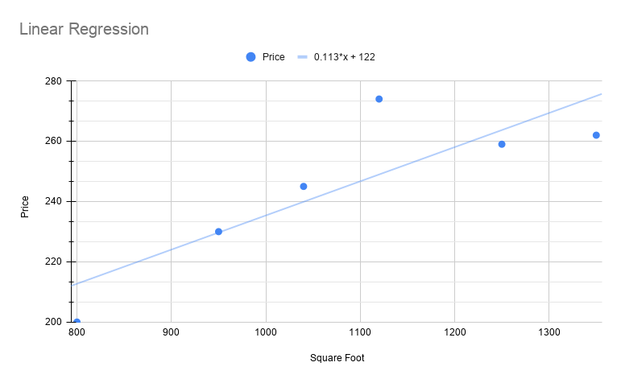
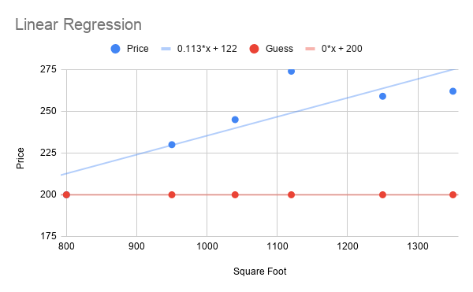
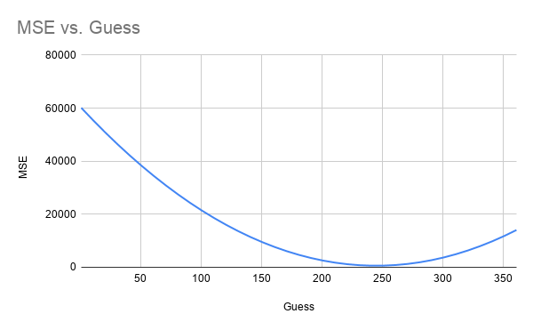
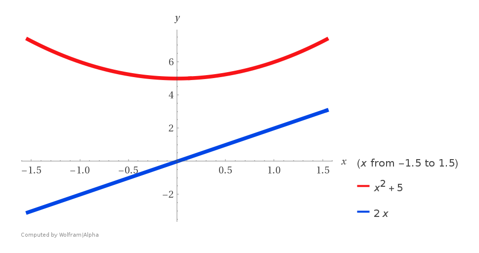
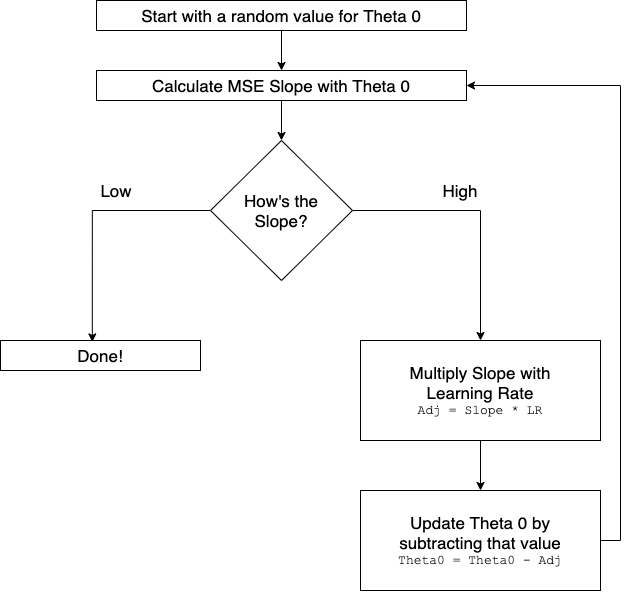
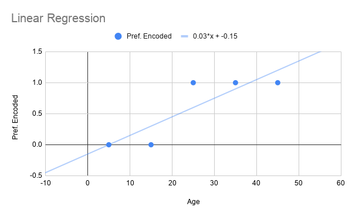

# Linear Regression

| Square Foot $(x)$ | Price $(y)$   |
| ----------------- | ------------- |
| 800 $x^{(0)}$     | 200 $y^{(0)}$ |
| 950 $x^{(1)}$     | 230 $y^{(1)}$ |
| 1040 $x^{(2)}$    | 245 $y^{(2)}$ |
| 1120 $x^{(3)}$    | 274 $y^{(3)}$ |
| 1250 $x^{(4)}$    | 259 $y^{(4)}$ |
| 1350 $x^{(5)}$    | 262 $y^{(5)}$ |

#### Hypothesis

This is an equation to help us relate our independent and dependent variables. For example, $\text{Price} = C1 + C2 \times \text{Square Foot}$.
$$
h_\theta(x) = \theta_0 + \theta_1(x)
$$




#### Methods for Deriving a Hypothesis

- Gradient Descent
- Ordinary Least Squares
- Generalized Least Squares
- Maximum Likelihood Estimation
- Least Absolute Deviation
- Principal Component Regression
- Others


# Gradient Descent

$$
\text{Mean Squared Error} = \frac{1}{m} \sum_{i=1}^m \big(\text{Guess}_i - \text{Actual}_i \big)^2
\\[4ex]
\text{Cost Function: } J(\theta) = \frac{1}{2m} \sum_{i=1}^m \big(h_\theta(x^{(i)}) - y^{(i)} \big)^2
$$

- The lower the MSE, the better
- MSE is never likely to be zero, it means perfect fit


### Computing MSE

- Let $\theta_0 = 1$ and $\theta_1=0$ ($\text{Price} = 1 + 0 \times \text{Square Foot}$)

  
| Square Foot $(x)$ | Price $(y)$   | Guess $\theta_0 + \theta_1 (x)$ |
| ----------------- | ------------- | ------------------------------- |
| 800 $x^{(0)}$     | 200 $y^{(0)}$ | 1                               |
| 950 $x^{(1)}$     | 230 $y^{(1)}$ | 1                               |
| 1040 $x^{(2)}$    | 245 $y^{(2)}$ | 1                               |
| 1120 $x^{(3)}$    | 274 $y^{(3)}$ | 1                               |
| 1250 $x^{(4)}$    | 259 $y^{(4)}$ | 1                               |
| 1350 $x^{(5)}$    | 262 $y^{(5)}$ | 1                               |
$$
\begin{align}
\text{Mean Squared Error} &= \frac{(1-200)^2 + (1-230)^2 + (1-245)^2 + (1-274)^2 + (1-259)^2 + (1-262)^2}{6} \\[2ex]
&= \frac{360792}{6} \\[2ex]
&= 60132
\end{align}
$$


- For $\theta_0 = 200$ and $\theta_1=0$ ($\text{Price} = 200 + 0 \times \text{Square Foot}$)

  
| Square Foot $(x)$ | Price $(y)$   | Guess $\theta_0 + \theta_1 (x)$ |
| ----------------- | ------------- | ------------------------------- |
| 800 $x^{(0)}$     | 200 $y^{(0)}$ | 200                             |
| 950 $x^{(1)}$     | 230 $y^{(1)}$ | 200                             |
| 1040 $x^{(2)}$    | 245 $y^{(2)}$ | 200                             |
| 1120 $x^{(3)}$    | 274 $y^{(3)}$ | 200                             |
| 1250 $x^{(4)}$    | 259 $y^{(4)}$ | 200                             |
| 1350 $x^{(5)}$    | 262 $y^{(5)}$ | 200                             |
$$
\begin{align}
\text{Mean Squared Error} &= \frac{(200-200)^2 + (200-230)^2 + (200-245)^2 + (200-274)^2 + (200-259)^2 + (200-262)^2}{6} \\[2ex]
&= \frac{15726}{6} \\[2ex]
&= 4287
\end{align}
$$


### Computing MSE for a bunch of points

| Guess | MSE   |
| ----- | ----- |
| 1     | 60132 |
| 11    | 55352 |
| 21    | 50772 |
| 31    | 46392 |
| 41    | 42212 |
| ...   | ...   |




Why can't we just try out different values of $\theta_0$ and find the lowest MSE?

- We don't know the possible range of $\theta_0$
- We don't know the step size for incrementing $\theta_0$
- Computational demand will be huge when adding more features

```javascript
for(i=190;i<510;i++) { // Theta 0
	for(j=190;j<510;j++) { // Theta 1
		for(k=190;k<510;k++) { // Theta 2
			...
			// Calculate MSE
		}
	}
}
```

The above code fragment resolves to $O(n^3)$ complexity, which is tremendous.


#### MSE vs Guess Plot Observations

- Slope is high for a terrible value of MSE
- Slope becomes flat near the valley where MSE value is the lowest
- Direction of the slope tells us where the optimal value of MSE is


## Derivatives

$$
\begin{align}
y &= x^2 + 5 \quad \quad [\text{Suppose this is MSE}] \\[2ex]
\frac{dy}{dx} &= 2x \quad \quad [\text{Slope of MSE}]
\end{align}
$$



When,

- $x=0$, $y=5$ and $\text{Slope} = 0$
- $x=1$, $y=6$ and $\text{Slope} = 2$
- $x=-1$, $y=-6$ and $\text{Slope} = -2$


## Making an Educated Guess

An educated guess for the optimal value of $\theta$ can be made if:

- Value of MSE is known at any given location
- Slope is known at that location

For viewing the spreadsheet, click [here](https://docs.google.com/spreadsheets/d/14_QwN2-Fhp-8ysNXVrnuwtgS3jrU0MpiO2myJj5aVck/edit?usp=sharing).


#### Slope Equation

$$
\begin{align}
\min_\theta \text(MSE) &= \frac{2}{m} \sum_{i=0}^m \big(\text{Guess}_i - \text{Actual}_i \big) \\[3ex]
\min_\theta J(\theta) &= \frac{2}{m} \sum_{i=0}^m \big(h_\theta(x^{(i)}) - y^{(i)} \big) \\[3ex]
\frac{d}{d\theta_0} J(\theta_0, \theta_1) &= \frac{2}{m} \sum_{i=0}^m \big((\theta_0 - \theta_1x^{(i)}) - y^{(i)}\big) \\[3ex]
\frac{d}{d\theta_1} J(\theta_0, \theta_1) &= \frac{2}{m} \sum_{i=0}^m \big((\theta_0 - \theta_1x^{(i)}) - y^{(i)}\big) \times (x^{(i)}) \\[3ex]
\end{align}
$$


#### Gradient Descent Workflow

Learning Rate ($\alpha$) - how quickly the algorithm changes the weights ($\theta_0, \theta_1, \dots$)




## Using TensorFlow for Computing

$$
\text{Slope} = \frac{\text{Inputs}^T \times ((\text{Inputs} \times \text{Weights}) - \text{Outputs})}{m}
$$


### Operation 1: $(\text{Inputs} \times \text{Weights})$

The matrices are not compatible for multiplication
$$
\text{Inputs Modified} =
\begin{bmatrix}
x_0^0 && x_1^0 \\[2ex]
x_0^1 && x_1^1 \\[2ex]
x_0^2 && x_1^2 \\[2ex]
x_0^3 && x_1^3 \\[2ex]
\end{bmatrix}
\quad \quad \quad
\text{Weights} =
\begin{bmatrix}
\theta_0 \\[2ex]
\theta_1 \\[2ex]
\theta_2
\end{bmatrix}
$$
To make it compatible, add an arbitrary column of 1's to Input Matrix
$$
\text{Inputs Modified} =
\begin{bmatrix}
1 && x_0^0 && x_1^0 \\[2ex]
1 && x_0^1 && x_1^1 \\[2ex]
1 && x_0^2 && x_1^2 \\[2ex]
1 && x_0^3 && x_1^3 \\[2ex]
\end{bmatrix}
\quad \quad \quad
\text{Weights} =
\begin{bmatrix}
\theta_0 \\[2ex]
\theta_1 \\[2ex]
\theta_2
\end{bmatrix}
$$
Following matrix multiplication is $h_\theta(x) = \theta_0 + \theta_1(x_1) + \theta_2(x_2)$ that is the guess/prediction
$$
\text{Guess} =
\begin{bmatrix}
1 && x_0^0 && x_1^0 \\[2ex]
1 && x_0^1 && x_1^1 \\[2ex]
1 && x_0^2 && x_1^2 \\[2ex]
1 && x_0^3 && x_1^3 \\[2ex]
\end{bmatrix}
\times
\begin{bmatrix}
\theta_0 \\[2ex]
\theta_1 \\[2ex]
\theta_2
\end{bmatrix}
=
\begin{bmatrix}
(1 \times \theta_0) + (x_0^0 \times \theta_1) + (x_1^0 \times \theta_2) \\[2ex]
(1 \times \theta_0) + (x_0^1 \times \theta_1) + (x_1^1 \times \theta_2) \\[2ex]
(1 \times \theta_0) + (x_0^2 \times \theta_1) + (x_1^2 \times \theta_2) \\[2ex]
(1 \times \theta_0) + (x_0^3 \times \theta_1) + (x_1^3 \times \theta_2)
\end{bmatrix}
=
\begin{bmatrix}
\theta_0 + \theta_1 x_0^0 + \theta_2 x_1^0 \\[2ex]
\theta_0 + \theta_1 x_0^1 + \theta_2 x_1^1 \\[2ex]
\theta_0 + \theta_1 x_0^2 + \theta_2 x_1^2 \\[2ex]
\theta_0 + \theta_1 x_0^3 + \theta_2 x_1^3
\end{bmatrix}
$$


### Operation 2: $(\text{Guess} - \text{Outputs})$

$$
\text{Difference} =
\begin{bmatrix}
\theta_0 + \theta_1 x_0^0 + \theta_2 x_1^0 \\[2ex]
\theta_0 + \theta_1 x_0^1 + \theta_2 x_1^1 \\[2ex]
\theta_0 + \theta_1 x_0^2 + \theta_2 x_1^2 \\[2ex]
\theta_0 + \theta_1 x_0^3 + \theta_2 x_1^3
\end{bmatrix}
-
\begin{bmatrix}
y_0 \\[2ex]
y_1 \\[2ex]
y_2 \\[2ex]
y_3
\end{bmatrix}
=
\begin{bmatrix}
D_0 \\[2ex]
D_1 \\[2ex]
D_2 \\[2ex]
D_3
\end{bmatrix}
$$


### Operation 3: $(\text{Inputs}^T \times \text{Difference})$

The matrices are not compatible for multiplication
$$
\text{Inputs Modified} =
\begin{bmatrix}
1 && x_0^0 && x_1^0 \\[2ex]
1 && x_0^1 && x_1^1 \\[2ex]
1 && x_0^2 && x_1^2 \\[2ex]
1 && x_0^3 && x_1^3 \\[2ex]
\end{bmatrix}
\quad \quad \quad
\text{Difference}
=
\begin{bmatrix}
D_0 \\[2ex]
D_1 \\[2ex]
D_2 \\[2ex]
D_3
\end{bmatrix}
$$
Transpose the Input Matrix to make it compatible for multiplication
$$
\text{Inputs Modified} =
\begin{bmatrix}
1 && 1 && 1 && 1 \\[2ex]
x_0^0 && x_0^1 && x_0^2 && x_0^3 \\[2ex]
x_1^0 && x_1^1 && x_1^2 && x_1^3
\end{bmatrix}
\quad \quad \quad
\text{Difference}
=
\begin{bmatrix}
D_0 \\[2ex]
D_1 \\[2ex]
D_2 \\[2ex]
D_3
\end{bmatrix}
$$
Slope Matrix
$$
\text{Slope} =
\frac{1}{m} \times
\begin{bmatrix}
1 && 1 && 1 && 1 \\[2ex]
x_0^0 && x_0^1 && x_0^2 && x_0^3 \\[2ex]
x_1^0 && x_1^1 && x_1^2 && x_1^3
\end{bmatrix}
\times
\begin{bmatrix}
D_0 \\[2ex]
D_1 \\[2ex]
D_2 \\[2ex]
D_3
\end{bmatrix}
=
\begin{bmatrix}
S_0 \\[2ex]
S_1 \\[2ex]
S_2
\end{bmatrix}
$$


### Operation 4: Update Weights

$$
\begin{align}
\text{Updated Weights} &=
\text{Old Weights} - \big(\text{Slopes} \times \alpha \big)
\\[4ex]
&= \begin{bmatrix}
\theta_0 \\[2ex]
\theta_1 \\[2ex]
\theta_2
\end{bmatrix} -
\bigg(
\begin{bmatrix}
S_0 \\[2ex]
S_1 \\[2ex]
S_2
\end{bmatrix} \times \alpha \bigg)
\end{align}
$$


### Operation 5: MSE (Optional)

$$
\begin{align}
\text{Mean Squared Error}
&= \frac{1}{m} \sum \bigg( (\text{Inputs} \times \text{Weights}) - \text{Outputs} \bigg)^2 \\[4ex]
&= \frac{1}{m}
\sum
\bigg(
\begin{bmatrix}
1 && x_0^0 && x_1^0 \\[2ex]
1 && x_0^1 && x_1^1 \\[2ex]
1 && x_0^2 && x_1^2 \\[2ex]
1 && x_0^3 && x_1^3 \\[2ex]
\end{bmatrix}
\times
\begin{bmatrix}
\theta_0 \\[2ex]
\theta_1 \\[2ex]
\theta_2
\end{bmatrix} -
\begin{bmatrix}
y_0 \\[2ex]
y_1 \\[2ex]
y_2 \\[2ex]
y_3
\end{bmatrix}
\bigg)^2
\end{align}
$$


## Standardisation & Normalisation

- Needs to be done feature-wise
- Same mean, variance and standard deviation (derived from standardising/normalising training set) to be used in standardising/normalising test sets
- Only do this to features / dependent variables

$$
\begin{align}
\text{Standardised Value} &= \frac{\text{Original Value} - \text{Mean}}{\text{Standard Deviation}} \\[4ex]
\text{Normalised Value} &= \frac{\text{Original Value} - \text{Min of Original Value}}{\text{Max of Original Value} - \text{Min of Original Value}} \\[4ex]
\text{Where,} \\[4ex]
\text{Variance} &= \frac{1}{m} \sum_{i=1}^m (\text{Mean} - x_i)^2 \\[4ex]
\text{Standard Deviation} &= \sqrt{\text{Variance}}
\end{align}
$$


## Accuracy Metrics

$$
\begin{align}
R^2 &= 1 - \frac{\text{Sum of Squares Residual}}{\text{Sum of Squares Total}} \\[2ex]
&= 1 - \frac{SS_{res}}{SS_{tot}} \\[2ex]
SS_{tot} &= \sum_{i=1}^m (\text{Actual} - \text{Mean})^2 \\[2ex]
SS_{res} &= \sum_{i=1}^m (\text{Actual} - \text{Predicted})^2
\end{align}
$$

- $0 < R^2 < 1$ means fit works, the better when $R^2 \rarr 1$
- $R^2 < 0$ means it's better to take the mean and use it as a predicted result (fit is terrible, worse than mean)


## Batch Gradient Descent

```javascript
const inputs = tf.tensor([
	[1, 2],
	[3, 4],
	[5, 6],
	[7, 8],
]);
const batchSize = 2;
const batchCount = 0
// Slice [Start Index (row, col)] [Size (row, col)]
// To select all rows/columns, use -1 in size
inputs.slice([batchCount, 0], [batchSize, -1]).print();
/*
[[1, 2],
[3, 4]]
*/
// Select next batch
batchCount += batchSize;
inputs.slice([batchCount, 0], [batchSize, -1]).print();
/*
[[5, 6],
[7, 8]]
*/

```

**Note:** For Stochastic Gradient Descent, use batch size of 1


# Logistic Regression

| Age  | Preference | Preference Encoded | Predicted Preference |
| ---- | ---------- | ------------------ | -------------------- |
| 5    | Movies     | 0                  | -0.0011              |
| 15   | Movies     | 0                  | 0.2967               |
| 25   | Books      | 1                  | 0.5945               |
| 35   | Books      | 1                  | 0.8923               |
| 45   | Books      | 1                  | 1.19                 |




### Hypothesis

This equation makes sure that the value always ranges between 0 and 1.
$$
\begin{align}
\text{Sigmoid Equation / Hypothesis} &= \frac{1}{1+e^{-(\theta_0 + \theta_1 x)}} = \frac{1}{1+e^{-z}} \\[3ex]
z &= \theta_0 + \theta_1 x \\[3ex]
\text{Euler's Constant } (e) &\approx 2.718
\end{align}
$$


### Cross Entropy

$$
\begin{align}
\text{MSE} &= \frac{1}{m} \sum_{i=1}^m (\text{Guess}_i - \text{Actual}_i)^2 \\[3ex]
\text{MSE (Linear Regression)} &= \frac{1}{m} \sum_{i=1}^m ((\theta_0 + \theta_1 x^{(i)}) - y^{(i)})^2 \\[3ex]
\text{Cross Entropy / Cost Function} &= - \bigg(\frac{1}{m} \bigg) \sum_{i-0}^m \text{Actual}_i \times \log(\text{Guess}_i) + (1 - \text{Actual}_i) \times \log(1 -\text{Guess}_i) \\[3ex]
&= - \bigg(\frac{1}{m} \bigg) \sum_{i-0}^m y^{(i)} \times \log\bigg(\frac{1}{1+e^{-(\theta_0 + \theta_1 x^{(i)})}} \bigg) + (1 - y^{(i)}) \times \log\bigg(1 -\frac{1}{1+e^{-(\theta_0 + \theta_1 x^{(i)})}} \bigg)
\end{align}
$$

Slope equations of Cross Entropy is identical to the slope equations of Mean Squared Error. Only change is that Sigmoid function needs to be applied.
$$
\begin{align}
\text{MSE Slope} &= \frac{\text{Inputs}^T \times ((\text{Inputs} \times \text{Weights}) - \text{Outputs})}{m} \\[3ex]
\text{Cross Entropy Slope} &= \frac{\text{Inputs}^T \times (\text{Sigmoid}(\text{Inputs} \times \text{Weights}) - \text{Outputs})}{m}
\end{align}
$$


Vectorized Equation for Cross Entropy:
$$
\text{Cross Entropy} = - \frac{1}{m} \times \bigg( \text{Actual}^T \times \log(\text{Guess}) + (1-\text{Actual}^T) \times \log(1-\text{Guess}) \bigg)
$$


### Accuracy Metrics

##### Step 1: Find the predictions

$$
\text{Test Set} \rarr Logistic Regression \rarr \text{Probabilities} \rarr \text{Decision Boundary} \rarr \text{Predictions}
\\[4ex]
\begin{bmatrix}
80 && 200 && 1.04 \\
97 && 250 && 1.9 \\
150 && 307 && 2.1 \\
180 && 425 && 2.2
\end{bmatrix}
\rarr \text{Logistic Regression} \rarr
\begin{bmatrix}
0.99 \\ 0.96 \\ 0.1 \\ 0.001
\end{bmatrix}
\rarr \text{Decision Boundary} \rarr
\begin{bmatrix}
1 \\ 1 \\ 0 \\ 0
\end{bmatrix}
$$

##### Step 2: Subtract from Actual Values

$$
\text{Predictions} - \text{Actual} = |\text{ Differences }| \\[3ex]
\begin{bmatrix}
1 \\ 1 \\ 0 \\ 0
\end{bmatrix} -
\begin{bmatrix}
1 \\ 0 \\ 1 \\ 0
\end{bmatrix} =
abs \biggr(
\begin{bmatrix}
0 \\ 1 \\ -1 \\ 0
\end{bmatrix}
\biggr) = 
\begin{bmatrix}
0 \\ 1 \\ 1 \\ 0
\end{bmatrix}
$$

##### Step 3: Find the sum of the differences

$$
sum \bigg(
\begin{bmatrix}
0 \\ 1 \\ 1 \\ 0
\end{bmatrix}
\bigg) = 2
$$


## Multi-Class Classification

##### Step 1: Multiply Inputs and Weights

$$
\begin{align}
\text{Inputs } \times \text{Weights} &=
\begin{bmatrix}
1 && x_0^0 \\
1 && x_0^1 \\
1 && x_0^2 \\
1 && x_0^3
\end{bmatrix}
\times
\begin{bmatrix}
\theta_0^a && \theta_0^b && \theta_0^c \\
\theta_1^a && \theta_1^b && \theta_1^c
\end{bmatrix} \\[4ex]
&=
\begin{bmatrix}
\theta_0^a + \theta_1^a x_0^0 && \theta_0^b + \theta_1^b x_0^0 && \theta_0^c + \theta_1^c x_0^0 \\
\theta_0^a + \theta_1^a x_0^1 && \theta_0^b + \theta_1^b x_0^1 && \theta_0^c + \theta_1^c x_0^1 \\
\theta_0^a + \theta_1^a x_0^2 && \theta_0^b + \theta_1^b x_0^2 && \theta_0^c + \theta_1^c x_0^2 \\
\theta_0^a + \theta_1^a x_0^3 && \theta_0^b + \theta_1^b x_0^3 && \theta_0^c + \theta_1^c x_0^3
\end{bmatrix} \\[4ex]
\end{align}
$$

##### Step 2: Sigmoid (Element Wise Operation) & take the highest probability

##### Step 3: Subtract Encoded Outputs

$$
\begin{align}
\text{Sigmoid}(\text{Inputs} \times \text{Weights}) - \text{Outputs} &=
\begin{bmatrix}
\Sigma(\theta_0^a + \theta_1^a x_0^0) && \Sigma(\theta_0^b + \theta_1^b x_0^0) && \Sigma(\theta_0^c + \theta_1^c x_0^0) \\
\Sigma(\theta_0^a + \theta_1^a x_0^1) && \Sigma(\theta_0^b + \theta_1^b x_0^1) && \Sigma(\theta_0^c + \theta_1^c x_0^1) \\
\Sigma(\theta_0^a + \theta_1^a x_0^2) && \Sigma(\theta_0^b + \theta_1^b x_0^2) && \Sigma(\theta_0^c + \theta_1^c x_0^2) \\
\Sigma(\theta_0^a + \theta_1^a x_0^3) && \Sigma(\theta_0^b + \theta_1^b x_0^3) && \Sigma(\theta_0^c + \theta_1^c x_0^3)
\end{bmatrix} -
\begin{bmatrix}
1 && 0 && 0 \\
0 && 1 && 0 \\
0 && 0 && 1 \\
0 && 1 && 0
\end{bmatrix} \\[4ex]
&=
\begin{bmatrix}
\Sigma(\theta_0^a + \theta_1^a x_0^0)-1 && \Sigma(\theta_0^b + \theta_1^b x_0^0) && \Sigma(\theta_0^c + \theta_1^c x_0^0) \\
\Sigma(\theta_0^a + \theta_1^a x_0^1) && \Sigma(\theta_0^b + \theta_1^b x_0^1)-1 && \Sigma(\theta_0^c + \theta_1^c x_0^1) \\
\Sigma(\theta_0^a + \theta_1^a x_0^2) && \Sigma(\theta_0^b + \theta_1^b x_0^2) && \Sigma(\theta_0^c + \theta_1^c x_0^2)-1 \\
\Sigma(\theta_0^a + \theta_1^a x_0^3) && \Sigma(\theta_0^b + \theta_1^b x_0^3)-1 && \Sigma(\theta_0^c + \theta_1^c x_0^3)
\end{bmatrix}
\end{align}
$$

##### Step 4: Multiply from Transpose of Features

$$
\text{Inputs}^T \times \big( \text{Sigmoid}(\text{Inputs} \times \text{Weights}) - \text{Outputs} \big) =
\begin{bmatrix}
1 && 1 && 1 && 1 \\
x_0^0 && x_0^1 && x_0^2 && x_0^3
\end{bmatrix}
\times
\begin{bmatrix}
\Sigma(\theta_0^a + \theta_1^a x_0^0)-1 && \Sigma(\theta_0^b + \theta_1^b x_0^0) && \Sigma(\theta_0^c + \theta_1^c x_0^0) \\
\Sigma(\theta_0^a + \theta_1^a x_0^1) && \Sigma(\theta_0^b + \theta_1^b x_0^1)-1 && \Sigma(\theta_0^c + \theta_1^c x_0^1) \\
\Sigma(\theta_0^a + \theta_1^a x_0^2) && \Sigma(\theta_0^b + \theta_1^b x_0^2) && \Sigma(\theta_0^c + \theta_1^c x_0^2)-1 \\
\Sigma(\theta_0^a + \theta_1^a x_0^3) && \Sigma(\theta_0^b + \theta_1^b x_0^3)-1 && \Sigma(\theta_0^c + \theta_1^c x_0^3)
\end{bmatrix}
$$


### Probability Distribution

- **Marginal Probability Distribution (Sigmoid):** Considers one possible output case in isolation (currently calculating). Total sum of probabilities can be greater or less than 1.

  **Sigmoid:** Probability of being the 1 label

  For example, $[\begin{matrix}0.34 && 0.45 && 0.67\end{matrix}]$ could be a prediction which means:

  - 34% probability of being a low efficiency vehicle (tells nothing about being medium or high)
  - 45% probability of being a medium efficiency vehicle (tells nothing about being low or high)
  - 67% probability of being a high efficiency vehicle (tells nothing about being low or medium)

  In this case, we don't care about this individual probabilities, we just need the highest single probability class. However this can be useful in other cases wherever applicable.
  $$
  \text{Sigmoid} = \frac{1}{1+e^{-(\theta_0 + \theta_1 x)}}
  $$
  

- **Conditional Probability Distribution (Softmax):** Considers all possible output cases together. Probability here has an interconnected meaning to each other.

  **Softmax:** Probability of being the 1 label, rather than the 0 label

  For example, $[\begin{matrix}0.25 && 0.35 && 0.40\end{matrix}]$ could be a prediction which means:

  - 25% chance of being low efficiency vehicle (and not being medium or high)
  - 35% chance of being medium efficiency vehicle (and not being low or high)
  - 40% chance of being high efficiency vehicle (and not being low or medium)

  $$
  \begin{align}
  \text{Softmax} &= \frac{e^{\theta_0 + \theta_1x}}{\sum_{k=0}^K e^{\theta_0^k + \theta_1x}} \\[3ex]
  \text{Softmax}(0.25) &= \frac{e^{25}}{e^{25}+e^{35}+e^{45}}
  \end{align}
  $$

  


### Accuracy Metrix

##### Step 1: Get the column numbers of highest probabilities from predictions

$$
\text{Predictions} \rarr \text{argMax} \rarr \text{Predicted Columns} \\[2ex]
\begin{bmatrix}
1 && 0 && 0 \\
0 && 1 && 0 \\
0 && 0 && 1 \\
0 && 1 && 0
\end{bmatrix}
\rarr \text{argMax} \rarr
\begin{bmatrix}
0 \\ 1 \\ 2 \\ 1
\end{bmatrix}
$$

##### Step 2: Compare with Actuals

$$
\text{Predicted Columns} \dots notEqual() \dots \text{Actual Columns} \rarr \text{Discrepancy Matrix} \\[2ex]
\begin{bmatrix}
0 \\ 1 \\ 2 \\ 1
\end{bmatrix}
notEqual()
\begin{bmatrix}
0 \\ 1 \\ 0 \\ 1
\end{bmatrix}
\rarr
\begin{bmatrix}
0 \\ 0 \\ 1 \\ 0
\end{bmatrix}
$$

##### Step 3: Take the sum of Discrepancy Matrix

