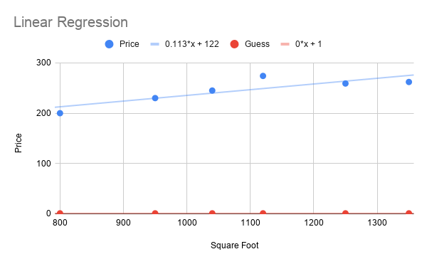

# Linear Regression

| Square Foot $(x)$ | Price $(y)$   |
| ----------------- | ------------- |
| 800 $x^{(0)}$     | 200 $y^{(0)}$ |
| 950 $x^{(1)}$     | 230 $y^{(1)}$ |
| 1040 $x^{(2)}$    | 245 $y^{(2)}$ |
| 1120 $x^{(3)}$    | 274 $y^{(3)}$ |
| 1250 $x^{(4)}$    | 259 $y^{(4)}$ |
| 1350 $x^{(5)}$    | 262 $y^{(5)}$ |

#### Hypothesis

This is an equation to help us relate our independent and dependent variables. For example, $\text{Price} = C1 + C2 \times \text{Square Foot}$.
$$
h_\theta(x) = \theta_0 + \theta_1(x)
$$


#### Methods for Deriving a Hypothesis

- Gradient Descent
- Ordinary Least Squares
- Generalized Least Squares
- Maximum Likelihood Estimation
- Least Absolute Deviation
- Principal Component Regression
- Others


# Gradient Descent

$$
\text{Mean Squared Error} = \frac{1}{m} \sum_{i=1}^m \big(\text{Guess}_i - \text{Actual}_i \big)^2
\\[4ex]
\text{Cost Function: } J(\theta) = \frac{1}{2m} \sum_{i=1}^m \big(h_\theta(x^{(i)}) - y^{(i)} \big)^2
$$

- The lower the MSE, the better
- MSE is never likely to be zero, it means perfect fit


### Computing MSE

- Let $\theta_0 = 1$ and $\theta_1=0$ ($\text{Price} = 1 + 0 \times \text{Square Foot}$)

  
| Square Foot $(x)$ | Price $(y)$   | Guess $\theta_0 + \theta_1 (x)$ |
| ----------------- | ------------- | ------------------------------- |
| 800 $x^{(0)}$     | 200 $y^{(0)}$ | 1                               |
| 950 $x^{(1)}$     | 230 $y^{(1)}$ | 1                               |
| 1040 $x^{(2)}$    | 245 $y^{(2)}$ | 1                               |
| 1120 $x^{(3)}$    | 274 $y^{(3)}$ | 1                               |
| 1250 $x^{(4)}$    | 259 $y^{(4)}$ | 1                               |
| 1350 $x^{(5)}$    | 262 $y^{(5)}$ | 1                               |
$$
\begin{align}
\text{Mean Squared Error} &= \frac{(1-200)^2 + (1-230)^2 + (1-245)^2 + (1-274)^2 + (1-259)^2 + (1-262)^2}{6} \\[2ex]
&= \frac{360792}{6} \\[2ex]
&= 60132
\end{align}
$$


- For $\theta_0 = 200$ and $\theta_1=0$ ($\text{Price} = 200 + 0 \times \text{Square Foot}$)

  
| Square Foot $(x)$ | Price $(y)$   | Guess $\theta_0 + \theta_1 (x)$ |
| ----------------- | ------------- | ------------------------------- |
| 800 $x^{(0)}$     | 200 $y^{(0)}$ | 200                             |
| 950 $x^{(1)}$     | 230 $y^{(1)}$ | 200                             |
| 1040 $x^{(2)}$    | 245 $y^{(2)}$ | 200                             |
| 1120 $x^{(3)}$    | 274 $y^{(3)}$ | 200                             |
| 1250 $x^{(4)}$    | 259 $y^{(4)}$ | 200                             |
| 1350 $x^{(5)}$    | 262 $y^{(5)}$ | 200                             |
$$
\begin{align}
\text{Mean Squared Error} &= \frac{(200-200)^2 + (200-230)^2 + (200-245)^2 + (200-274)^2 + (200-259)^2 + (200-262)^2}{6} \\[2ex]
&= \frac{15726}{6} \\[2ex]
&= 4287
\end{align}
$$


### Computing MSE for a bunch of points

| Guess | MSE   |
| ----- | ----- |
| 1     | 60132 |
| 11    | 55352 |
| 21    | 50772 |
| 31    | 46392 |
| 41    | 42212 |
| ...   | ...   |


Why can't we just try out different values of $\theta_0$ and find the lowest MSE?

- We don't know the possible range of $\theta_0$
- We don't know the step size for incrementing $\theta_0$
- Computational demand will be huge when adding more features

```javascript
for(i=190;i<510;i++) { // Theta 0
	for(j=190;j<510;j++) { // Theta 1
		for(k=190;k<510;k++) { // Theta 2
			...
			// Calculate MSE
		}
	}
}
```

The above code fragment resolves to $O(n^3)$ complexity, which is tremendous.


#### MSE vs Guess Plot Observations

- Slope is high for a terrible value of MSE
- Slope becomes flat near the valley where MSE value is the lowest
- Direction of the slope tells us where the optimal value of MSE is


## Making an Educated Guess

An educated guess for the optimal value of $\theta$ can be made if:

- Value of MSE is known at any given location
- Slope is known at that location


#### Slope Equation

$$
\begin{align}
\min_\theta \text(MSE) &= \frac{2}{m} \sum_{i=0}^m \big(\text{Guess}_i - \text{Actual}_i \big) \\[3ex]
\min_\theta J(\theta) &= \frac{2}{m} \sum_{i=0}^m \big(h_\theta(x^{(i)}) - y^{(i)} \big) \\[3ex]
\frac{d}{d\theta_0} J(\theta_0, \theta_1) &= \frac{2}{m} \sum_{i=0}^m \big((\theta_0 - \theta_1x^{(i)}) - y^{(i)}\big) \\[3ex]
\frac{d}{d\theta_1} J(\theta_0, \theta_1) &= \frac{2}{m} \sum_{i=0}^m \big((\theta_0 - \theta_1x^{(i)}) - y^{(i)}\big) \times (x^{(i)}) \\[3ex]
\end{align}
$$


#### Learning Rate

